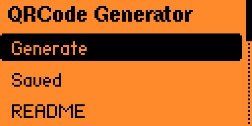
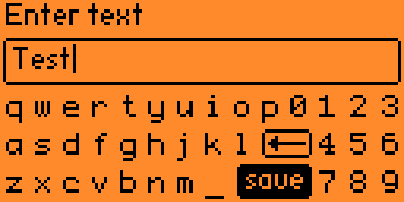
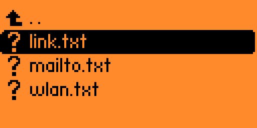
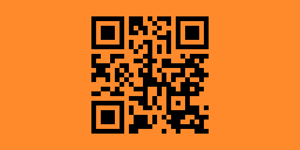
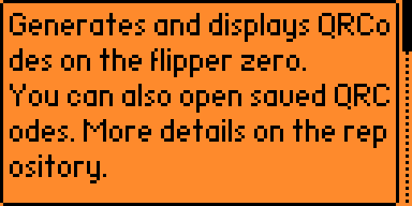

# Flipper Zero: QRCode Generator
Generates and displays QRCodes on the flipper zero.

|  |  |   |
| ------------- | ------------- | ------------- |
|   |   | &nbsp;  |

## Download
Grab the `qrcode_generator.fap` from the latest release. 

## Installation 
After the download copy the `.fap` file onto your flipper in the folder 
`apps/Tools`. Then create in the `apps_data` folder the subfolder 
`qrcode_generator` to open existing QRCodes or to save it on the sdcard.

## Features
- Generating QRCodes based on the entered input
- Open QRCodes which are saved on the sdcard

## Future Features
- [ ] Save newly generated QRCodes on the sdcard
- [ ] Export generated QRCodes as bitmap (.pbm image)

## Data format
To generate newly QRCodes, you can just enter the data you want to stored 
in the QRCode.

To open saved QRCodes you need on a regular basis, just create a `.txt` file 
in the `apps_data/qrcode_generator/` folder on the sdcard with just the 
data in it. The app reads the content of the file and creates an QRCode with 
it. You need no further specific format or something else. 

**Examples:**
```text
# Open new mail:
mailto:example@example.com

# Open link:
https://github.com/qw3rtty

# Connect to a WIFI:
WIFI:S:<ssid>;P:<password>;T:<encryption>;
```

## Using the App
The app is acutally straightforward. If you start it, you have three menu
options. One to generate a new QRCode, one to open existing ones from the 
sdcard and one to get the basic information about this app.

## qrcode library
The application uses the awesome C library from [nayuki](https://github.com/nayuki/QR-Code-generator)
to generate and display the QRCodes. 

